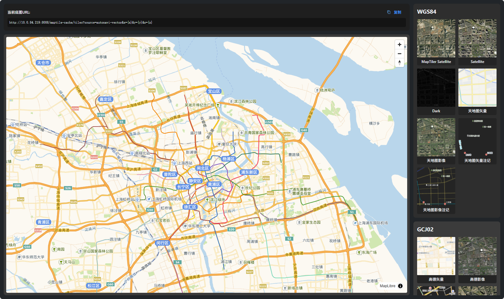

# 🗺️ Maptile Preview

A modern, responsive web application for previewing and managing map tile sources with support for multiple coordinate systems and map providers.



## ✨ Features

## ✨ Features

- **Multi-coordinate System Support**: WGS84 and GCJ02 coordinate systems
- **Rich Map Sources**: Integration with multiple map providers (MapTiler, Tianditu, Autonavi)
- **Interactive Map View**: Real-time map preview with tile source switching
- **Source Management**: Organized display of available map sources by category
- **URL Copy Functionality**: Easy copy of current tile URL template
- **Responsive Design**: Modern UI with Mantine components and Tailwind CSS
- **Dark Theme**: Optimized dark interface for better visibility
- **TypeScript Support**: Full type safety and modern React development

## 🚀 Quick Start

### Prerequisites

- Node.js 18+ 
- pnpm 10.16.1+ (package manager)
- Docker & Docker Compose (optional, for containerized deployment)

### Local Development

1. **Clone and Install**
   ```bash
   git clone <repository-url>
   cd maptile-preview
   pnpm install
   ```

2. **Start Development Server**
   ```bash
   pnpm dev
   ```
   
3. **Open Application**
   - Visit http://localhost:5000
   - Map preview will load with default GCJ02 source

### Build for Production

```bash
# Build optimized bundle
pnpm build

# Preview production build
pnpm preview
```

## 🐳 Docker Deployment

### Quick Deploy with Docker Compose

```bash
# Build and run container
docker-compose up --build

# Access application
# Open http://localhost
```

### Manual Docker Build

```bash
# Build image
docker build -t maptile-preview .

# Run container
docker run -p 80:80 --name maptile-preview maptile-preview
```

📖 **Detailed Docker Guide**: See [DOCKER.md](./DOCKER.md) for comprehensive deployment instructions, configuration options, and production best practices.

## 📁 Project Structure

```
maptile-preview/
├── src/                    # Source code
│   ├── components/        # React components
│   │   ├── MapView.tsx    # Interactive map component
│   │   ├── SourceItem.tsx # Individual source item
│   │   └── SourceList.tsx # Source list container
│   ├── types/             # TypeScript type definitions
│   ├── app.tsx            # Main application component
│   ├── index.tsx          # Application entry point
│   └── globals.css        # Global styles
├── public/                # Static assets
│   └── sources.json       # Map source configurations
├── nginx.conf             # Nginx configuration for production
├── docker-compose.yml     # Docker Compose configuration
└── Dockerfile             # Multi-stage Docker build
```

## 🔧 Configuration

### Map Sources Configuration

Edit `public/sources.json` to add or modify map sources:

```json
{
  "title": "WGS84",
  "name": "Custom Source",
  "urlTemplate": "http://your-server/tiles?x={x}&y={y}&z={z}"
}
```

### Build Configuration

Modify `rsbuild.config.ts` for build customization:
- Port configuration
- PostCSS plugins
- Tailwind CSS integration
- Mantine theming

### Environment Variables

When using Docker:
- `NGINX_HOST`: Hostname (default: localhost)
- `NGINX_PORT`: Port number (default: 80)

## 🎯 Key Components

### MapView Component
- Renders interactive map using react-map-gl and maplibre-gl
- Supports dynamic tile source switching
- Responsive map container with proper error handling

### Source Management
- Sources grouped by coordinate system (WGS84, GCJ02)
- Real-time URL template display
- One-click copy functionality
- Organized card-based layout

### UI/UX Features
- Dark theme optimized for map viewing
- Smooth animations and transitions
- Responsive grid layout
- Intuitive source selection interface

## 🛠️ Technology Stack

- **Frontend Framework**: React 19.1.1 with TypeScript
- **Build Tool**: Rsbuild (Vite-based)
- **UI Library**: Mantine 8.3.1
- **Styling**: Tailwind CSS 4.1.13 with PostCSS
- **Map Library**: react-map-gl with maplibre-gl
- **Package Manager**: pnpm with workspace support
- **Container**: Multi-stage Docker build with nginx
- **Code Quality**: ESLint with Antfu config, Husky, lint-staged

## 🔍 Development Workflow

### Code Quality

```bash
# Run linting
pnpm lint

# Fix linting issues
pnpm lint --fix
```

### Git Hooks

Pre-configured with Husky and lint-staged:
- Automatic linting on commit
- Code formatting checks
- Pre-commit quality checks

## 📱 Browser Support

- Chrome 88+
- Firefox 87+
- Safari 14+
- Edge 88+

## 🌐 API Integration

The application expects a map tile service at `http://10.0.84.219:8008/maptile-cache/` with the following endpoint pattern:

```
GET /tiles?source={source-name}&x={x}&y={y}&z={z}
```

### Supported Sources

**WGS84 Coordinate System:**
- MapTiler Satellite
- Satellite imagery
- Dark theme maps
- Tianditu vector and imagery layers
- Tianditu label overlays

**GCJ02 Coordinate System:**
- Autonavi (Gaode) vector maps
- Autonavi satellite imagery
- Autonavi road networks
- MapTiler Satellite (GCJ02)

## 🤝 Contributing

1. Fork the repository
2. Create a feature branch: `git checkout -b feature-name`
3. Make changes and test thoroughly
4. Run linting: `pnpm lint`
5. Commit changes: `git commit -m 'Add feature description'`
6. Push to branch: `git push origin feature-name`
7. Submit a Pull Request

## 📄 License

This project is licensed under the MIT License - see the [LICENSE](./LICENSE) file for details.

## 🆘 Troubleshooting

### Common Issues

**Build Failures:**
- Ensure pnpm version matches `packageManager` field
- Clear node_modules and reinstall: `rm -rf node_modules && pnpm install`

**Map Not Loading:**
- Check network connectivity to tile server
- Verify sources.json configuration
- Check browser console for CORS errors

**Docker Issues:**
- Ensure Docker daemon is running
- Check port availability (default: 80)
- Review container logs: `docker logs maptile-preview`

### Performance Optimization

- Production build includes nginx with gzip compression
- Static asset caching configured (1 year for CSS/JS, 1 hour for JSON)
- Multi-stage Docker build minimizes final image size
- pnpm workspace for efficient dependency management

## 📞 Support

For issues and questions:
- Check existing issues in the repository
- Review troubleshooting section above
- Create a new issue with detailed information

---

**Made with ❤️ using React, TypeScript, and modern web technologies**