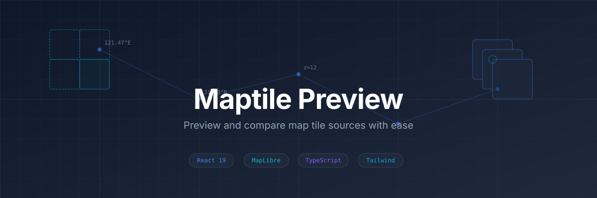
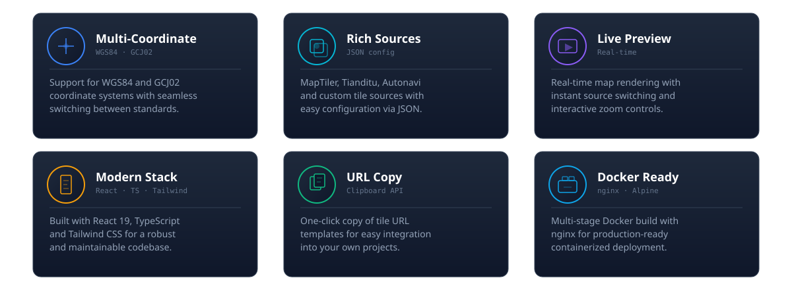

<p align="center">
  
</p>

<p align="center">
  <a href="#features">Features</a> •
  <a href="#quick-start">Quick Start</a> •
  <a href="#tech-stack">Tech Stack</a> •
  <a href="#configuration">Configuration</a> •
  <a href="#docker">Docker</a> •
  <a href="#contributing">Contributing</a>
</p>

<p align="center">
  
  
  
  
  
</p>

---

**Maptile Preview** is a modern web application for previewing and comparing map tile sources. It supports multiple coordinate systems (WGS84, GCJ02) and integrates with popular map providers like MapTiler, Tianditu, and Autonavi.

## Features

<p align="center">
  
</p>

- **Multi-Coordinate System** — Seamlessly switch between WGS84 and GCJ02 coordinate standards
- **Rich Map Sources** — Pre-configured for MapTiler, Tianditu, Autonavi, and custom tile servers
- **Live Preview** — Real-time map rendering with instant source switching
- **URL Copy** — One-click copy of tile URL templates for easy integration
- **Modern Stack** — Built with React 19, TypeScript, and Tailwind CSS
- **Docker Ready** — Multi-stage Docker build with nginx for production deployment

## Quick Start

<p align="center">
  
</p>

### Prerequisites

- Node.js 24+
- pnpm 11+ (package manager)

### Installation

```bash
# Clone the repository
git clone https://github.com/Muromi-Rikka/maptile-preview.git
cd maptile-preview

# Install dependencies
pnpm install

# Start development server
pnpm dev
```

Open [http://localhost:5555](http://localhost:5555) in your browser.

### Build for Production

```bash
# Build optimized bundle
pnpm build

# Preview production build
pnpm preview
```

## Tech Stack

<p align="center">
  
</p>

| Category | Technology |
|----------|------------|
| **Framework** | React 19 with TypeScript |
| **Build Tool** | Rsbuild (Rspack-based) |
| **UI Library** | shadcn/ui components |
| **Styling** | Tailwind CSS 4 |
| **Map Library** | react-map-gl + MapLibre GL |
| **State Management** | TanStack Query |
| **Code Quality** | ESLint with @antfu/eslint-config |
| **Container** | Docker with nginx |

## Configuration

### Map Sources

Edit `public/sources.json` to configure your tile sources:

```json
[
  {
    "title": "WGS84",
    "name": "MapTiler Satellite",
    "urlTemplate": "https://api.maptiler.com/tiles/satellite/{z}/{x}/{y}.jpg?key=YOUR_KEY"
  },
  {
    "title": "GCJ02",
    "name": "Autonavi Vector",
    "urlTemplate": "https://webrd01.is.autonavi.com/appmaptile?lang=zh_cn&size=1&scale=1&style=8&x={x}&y={y}&z={z}"
  }
]
```

### Coordinate Systems

The application supports two coordinate systems:

| System | Description | Use Case |
|--------|-------------|----------|
| **WGS84** | Standard GPS coordinates | MapTiler, Tianditu, OpenStreetMap |
| **GCJ02** | China-specific offset coordinates | Autonavi, Gaode Maps |

## Docker

### Quick Deploy

```bash
# Build and run with Docker Compose
docker-compose up --build

# Access at http://localhost
```

### Manual Build

```bash
# Build image
docker build -t maptile-preview .

# Run container
docker run -p 80:80 --name maptile-preview maptile-preview
```

📖 See [DOCKER.md](./DOCKER.md) for detailed deployment instructions.

## Project Structure

```
maptile-preview/
├── src/
│   ├── components/
│   │   ├── MapView.tsx      # Interactive map component
│   │   ├── SourceItem.tsx   # Individual source selector
│   │   └── SourceList.tsx   # Source list container
│   ├── types/
│   │   └── source.ts        # TypeScript type definitions
│   ├── app.tsx              # Main application component
│   └── index.tsx            # Application entry point
├── public/
│   └── sources.json         # Map source configurations
├── assets/
│   └── readme/              # README visual assets
├── Dockerfile               # Multi-stage Docker build
├── docker-compose.yml       # Docker Compose config
└── nginx.conf               # Nginx configuration
```

## Development

### Available Scripts

| Command | Description |
|---------|-------------|
| `pnpm dev` | Start development server |
| `pnpm build` | Build for production |
| `pnpm preview` | Preview production build |
| `pnpm lint` | Run ESLint |
| `pnpm lint:fix` | Fix lint issues |

### Code Quality

Pre-configured with Husky and lint-staged for automatic linting on commit.

## Contributing

1. Fork the repository
2. Create a feature branch: `git checkout -b feature/my-feature`
3. Make your changes
4. Run linting: `pnpm lint`
5. Commit your changes: `git commit -m 'feat: add my feature'`
6. Push to the branch: `git push origin feature/my-feature`
7. Submit a Pull Request

## Browser Support

- Chrome 88+
- Firefox 87+
- Safari 14+
- Edge 88+

## License

This project is licensed under the MIT License - see the [LICENSE](./LICENSE) file for details.

---

<p align="center">
  Made with ❤️ by <a href="https://github.com/Muromi-Rikka">Rikka</a>
</p>